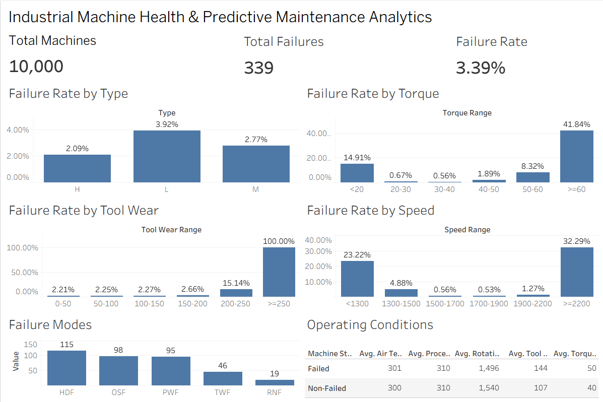

# Industrial Machine Health & Predictive Maintenance Analytics

## Project Overview

This project analyses industrial machine operating data to identify patterns associated with machine failures and derive insights that can support maintenance decision-making.

The analysis uses the UCI AI4I 2020 Predictive Maintenance Dataset containing 10,000 machine records.

The project follows a practical data analytics workflow using Excel, Python, SQL and Tableau.

---

## Business Problem

Machine failures can lead to production downtime, maintenance costs and operational disruptions.

The objective of this project is to analyse machine operating conditions and answer:

> Can machine operating data be analysed to identify patterns associated with machine failures and help maintenance teams make better decisions?

---

## Tools & Technologies

- Python
- Pandas
- Excel
- SQL
- SQLite
- Tableau Public
- VS Code

---

## Project Workflow

Raw Dataset  
↓  
Excel Data Inspection  
↓  
Python / Pandas Analysis  
↓  
SQL Analysis  
↓  
Tableau Visualization & Dashboard  ()
↓  
Insights & Maintenance Recommendations

---

## Dataset

**Dataset:** AI4I 2020 Predictive Maintenance Dataset

**Source:** UCI Machine Learning Repository

The dataset contains:

- 10,000 machine records
- Machine type
- Air temperature
- Process temperature
- Rotational speed
- Torque
- Tool wear
- Machine failure indicators
- Failure mode indicators

**Dataset Source:**  
https://archive.ics.uci.edu/dataset/601/ai4i

---

## Key Findings

### Overall Failure Rate

- Total machines analysed: **10,000**
- Total failures: **339**
- Overall failure rate: **3.39%**

### Machine Type

Type L machines had the highest observed failure rate:

- Type L: **3.92%**
- Type M: **2.77%**
- Type H: **2.09%**

### Torque

Higher torque ranges showed substantially higher observed failure rates.

- 30–40 Nm: **0.56%**
- 50–60 Nm: **8.32%**
- ≥60 Nm: **41.84%**

### Tool Wear

Failure rates increased substantially at higher levels of tool wear.

- 0–50 min: **2.21%**
- 150–200 min: **2.66%**
- 200–250 min: **15.14%**

### Rotational Speed

Extreme rotational-speed ranges showed elevated observed failure rates.

- <1300 RPM: **23.22%**
- 1500–1700 RPM: **0.56%**
- ≥2200 RPM: **32.29%**

### Failure Modes

The most frequently observed failure modes were:

1. HDF — **115 occurrences**
2. OSF — **98 occurrences**
3. PWF — **95 occurrences**

---

## Maintenance Recommendations

Based on the analysis:

1. Prioritize inspection of machines operating under high-torque conditions.
2. Closely monitor machines approaching higher tool-wear levels, particularly beyond 200 minutes.
3. Investigate machines operating at extreme rotational speeds.
4. Consider machine type when prioritizing maintenance resources alongside operating conditions.
5. Prioritize diagnostic and preventive actions around frequently occurring failure modes.

These findings indicate associations in the dataset and should not be interpreted as proof of causation.

---

## Project Structure

```text
Industrial_Machine_Health_Analytics
│
├── data
│   ├── raw
│   └── processed
│
├── excel
│   └── ai4i2020.xlsx
│
├── python
│   └── 01_data_inspection.py
│
├── sql
│   ├── 01_load_data.py
│   ├── 02_run_query.py
│   └── 01_basic_analysis.sql
│
├── tableau
│
├── dashboard
│   └── dashboard.png 
│
└── README.md


## Conclusion

The analysis identified several operating-condition patterns associated with machine failures, particularly higher torque, increased tool wear and extreme rotational speeds.

The Tableau dashboard brings these findings together into a visual overview that can help maintenance teams identify higher-risk operating conditions and prioritize further investigation.

```
